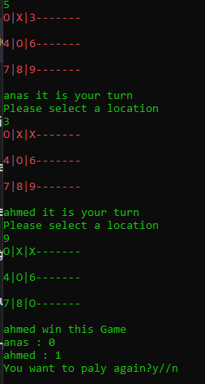

# Lab 04: Tic-Tac-Toe

## Summary
This lab assignment focuses on creating a two-player, turn-based Tic-Tac-Toe program. The program allows players to take turns selecting positions on the board and replaces them with either an X or an O. The game handles switching between players, detects winners, and can result in a tie/draw if no winner can be determined.

## Visuals

.png)

## Usage
To use the Tic-Tac-Toe program, follow these steps:

1. Clone the repository to your local machine.
2. Open the terminal and navigate to the project directory.
3. Run the program by executing the command `dotnet run`.
4. The game will display the initial empty game board.
5. Players will take turns entering their moves by specifying the position they want to mark (1-9).
6. The program will validate the input and update the game board accordingly.
7. After each move, the program will check for a winner or a tie/draw condition.
8. If a winner is found, the program will display the winning message and end the game.
9. If a tie/draw occurs, the program will display the tie message and end the game.
10. Players can choose to play again or exit the program.
11. Enjoy playing Tic-Tac-Toe!

## Additional Details
- The Tic-Tac-Toe game board is a 3x3 grid represented by numbers 1 to 9. Players select a position by inputting the corresponding number.
- The game enforces the turn-based nature and displays the current player's turn.
- The program includes error handling for invalid inputs, such as selecting a position that is already marked or entering an invalid position.
- The game continues until a winner is determined or all positions on the board are occupied.
- The program is implemented in C# using concepts and resources covered in previous labs, lectures, and assigned pre-work.
- The code follows best practices and includes comments for better understanding.

## License
This project is licensed under the [MIT License](LICENSE).
